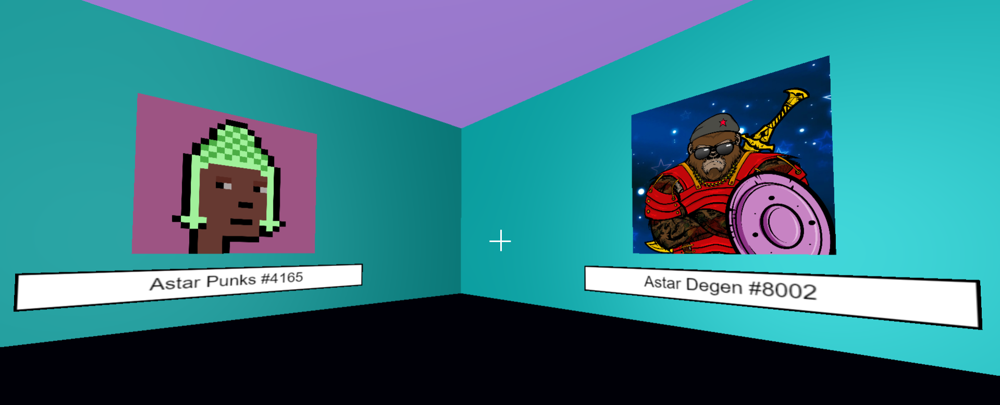

# Astar NFT gallery

A 3D gallery where users will be able to look at their NFTs and LITERALLY walk around this gallery using the keyboard (W, A, S, D) and mouse.

The project will be of interest to owners of Astar NFT collections who would like to look at their pictures in an interactive way.

------------

- **Video demo:** 
- **Live demo website:** [https://astar-nft-gallery.netlify.app/](https://astar-nft-gallery.netlify.app/)

--------

### What was used?

1. HTML & CSS & JS
2. [**web3js**](https://web3js.readthedocs.io/en/v1.7.3)
3. [**Three.js**](https://threejs.org) - Library for creating the 3D gallery;

### How it was built:

The front-End of this DApp was created using HTML, CSS, JS. 

Some config data from `scripts/config.js` file:
  * `EXPLORER_URL` - link to Astar explorer
  * `RPC` - Astar RPC

--------

**Future plans / To do:**

- Add new NFT collections from Astar;
- Improve the method of retrieving NFTs data: indexing data to off-chain. This will avoid API rate limiting when interacting directly with the smart contract and it will also speed up the time of receiving data from the IPFS (sometimes the delay is very large);
- Improve the design of 3D gallery, add new buildings, the ability to interact with some objects directly from the gallery, multiplayer feature;

-------

